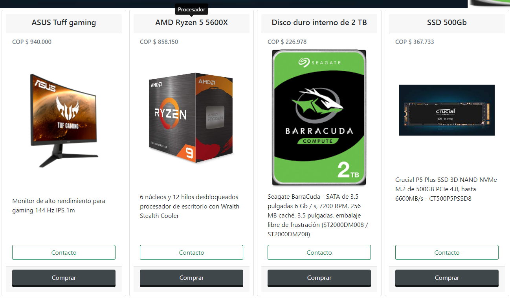
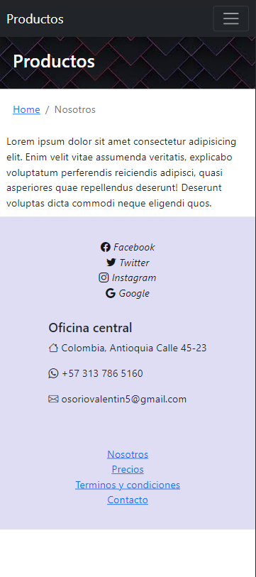
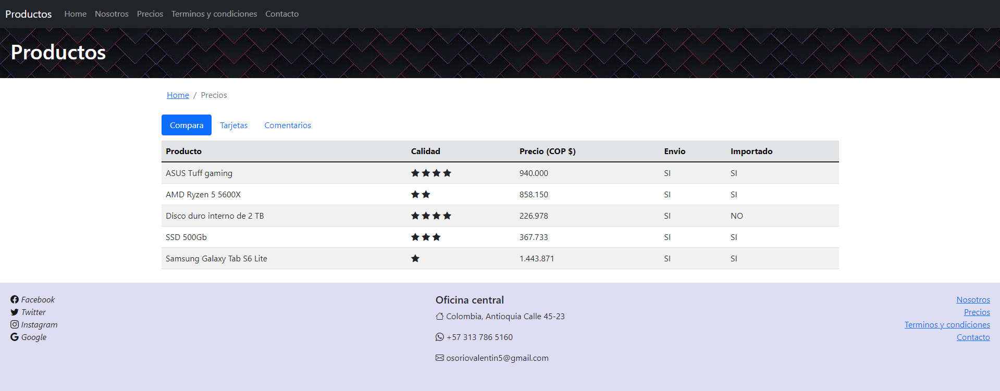

# README #

Ap;icacion e-commerce de productos

Para correr la aplicacion, luego de clonar el repositorio localmente
1. Abrir una consola en la ubicación del proyecto.
2. Tener instalado Node.js
3. Ejecutar comando `npm install`
4. Ejecutar comando `npm run dev`

Algunas imagenes del proyecto

